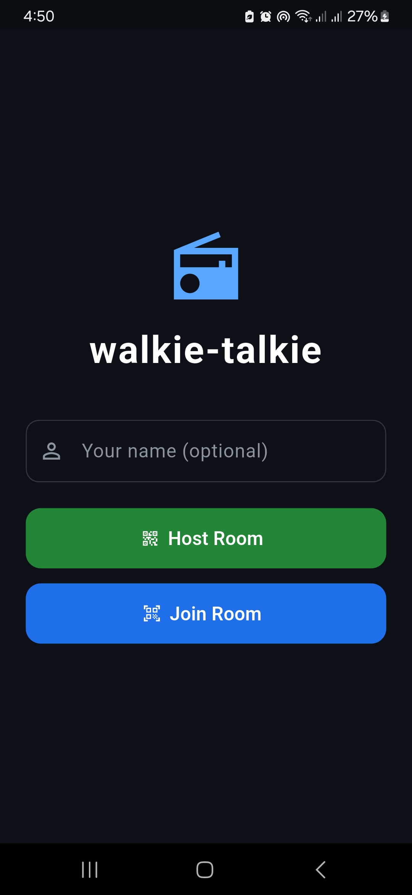
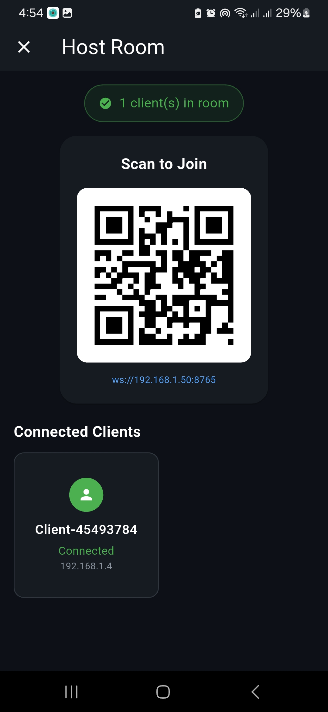
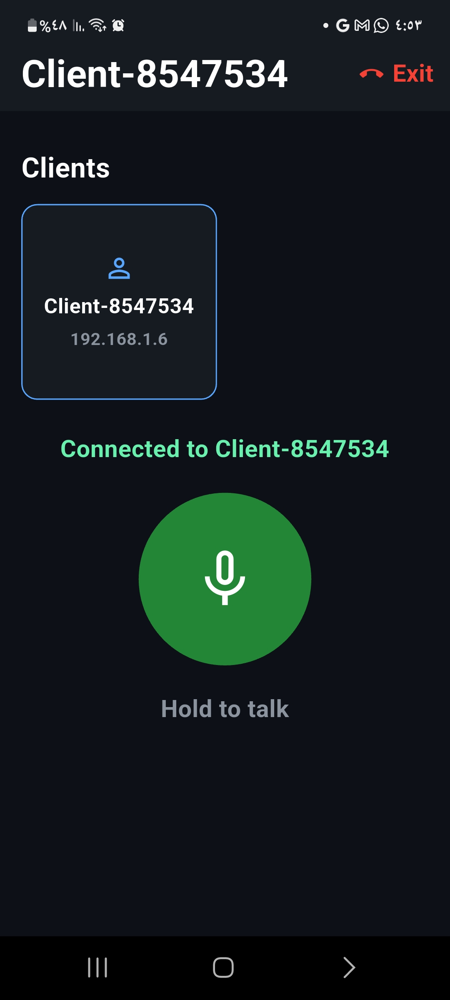

# Comunicate (Walkie-Talkie)

An offline, local-network walkie-talkie application built with Flutter. Experience real-time, low-latency audio communication without the need for an active internet connection.

## 📸 Screenshots

| Home Screen | QR Scanner | Room View |
| :---: | :---: | :---: |
|  |  |  |

*(Note: Replace the image paths above with actual screenshots when available)*

## ✨ Features

*   **Offline First**: Communicate strictly over your local Wi-Fi network (LAN). No internet access required!
*   **WebRTC P2P Audio**: Crystal clear, low-latency one-to-one audio streaming utilizing WebRTC.
*   **QR Code Discovery**: Effortlessly join rooms by scanning QR codes. Uses in-process WebSocket signaling for handshake and room discovery.
*   **Push-to-Talk (PTT)**: Built-in floor control to prevent audio collisions.
*   **Smart Audio Routing**: Automatic routing to connected Bluetooth devices.
*   **Clean Architecture**: Scalable, modular architecture separating network logic from UI presentation.

## 🛠️ Technical Overview

This application tackles the challenge of real-time communication without a centralized cloud server by leveraging local network protocols:

### Local WebRTC & Signaling
Instead of using an external signaling server (like Firebase or a cloud Node.js instance), the app acts as its own **WebSocket signaling server**. 
When a user "Hosts" a room, the app broadcasts its local IP via a QR code. Peers scan this code to establish a direct WebSocket connection, exchanging WebRTC SDP offers and ICE candidates entirely localized to the LAN.

### Audio Pipeline
Audio is captured, encoded, and transmitted over a Peer-to-Peer (P2P) WebRTC data channel ensuring minimal latency. The Push-to-Talk (PTT) mechanism restricts the audio stream to one speaker at a time, closely emulating traditional walkie-talkie hardware constraints.

## 🚀 Getting Started

### Prerequisites
*   [Flutter SDK](https://docs.flutter.dev/get-started/install) (latest stable)
*   Two physical test devices (Android/iOS) connected to the **same Wi-Fi network**.

### Installation

1.  **Clone the repository:**
    ```bash
    git clone https://github.com/tayseergit/Walkie_Talkie.git
    cd comunicate
    ```

2.  **Install dependencies:**
    ```bash
    flutter pub get
    ```

3.  **Run the app:**
    ```bash
    flutter run
    ```
    *Note: Emulators might not reliably route local network traffic or simulate microphones effectively. Physical devices are strongly recommended.*

## 🏗️ Architecture

The app follows Clean Architecture principles:
*   **Presentation**: Flutter UI, State Management.
*   **Domain**: Business rules, PTT state, WebRTC interfaces.
*   **Data**: WebSocket server/client implementations, Local Network IP filtering, WebRTC session handling.
